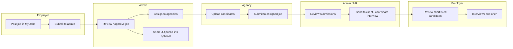

# How to Use Guide

**CodersBrain AI Recruitment Platform** — end-user guide for employers, agencies (vendors), candidates, and administrators.

**Live application:** [https://codersbrain.ai](https://codersbrain.ai)

---

## Table of contents

1. [What this platform does](#1-what-this-platform-does)
2. [User roles and who sees what](#2-user-roles-and-who-sees-what)
3. [Getting started](#3-getting-started)
4. [End-to-end recruitment workflow](#4-end-to-end-recruitment-workflow)
5. [Employer (client) guide](#5-employer-client-guide)
6. [Agency / vendor guide](#6-agency--vendor-guide)
7. [Candidate guide](#7-candidate-guide)
8. [Admin, manager, and HR guide](#8-admin-manager-and-hr-guide)
9. [Public pages (no login)](#9-public-pages-no-login)
10. [AI features](#10-ai-features)
11. [Notifications, profile, and theme](#11-notifications-profile-and-theme)
12. [Troubleshooting](#12-troubleshooting)
13. [Quick reference by task](#13-quick-reference-by-task)

---

## 1. What this platform does

CodersBrain connects four types of users in one recruitment workflow:

| Who | Main purpose |
|-----|----------------|
| **Employer (client)** | Post jobs, review shortlisted talent, manage bench, run interviews |
| **Agency (vendor)** | Upload candidates, submit profiles to jobs, track interviews and commissions |
| **Candidate** | Browse jobs, apply, track applications, interviews, and offers |
| **Admin / Manager / HR** | Approve users and jobs, assign work to agencies, coordinate interviews, configure AI |

Core capabilities include:

- Job posting and admin approval  
- Agency assignment and candidate submissions  
- **AI resume parsing** (skills, experience, category tags, summaries)  
- Interview coordination and calendar  
- Commissions and subscriptions (admin)  
- **Share JD** — public apply links for verified jobs  
- KYC verification for agencies and other registrants  

---

## 2. User roles and who sees what

After login, the **left sidebar** shows only the menus your role is allowed to use.

| Role | Dashboard path | Typical access |
|------|----------------|----------------|
| **Admin** | `/admin/dashboard` | Full system: users, KYC, jobs, Share JD, submissions, vendors, commissions, AI settings |
| **Manager** | `/admin/dashboard` | Same admin area; some menus depend on permissions set by admin |
| **HR** | `/admin/dashboard` | Same admin area; permissions configured by admin |
| **Employer** | `/employer/dashboard` | Jobs, candidates, bench, interviews, commissions |
| **Agency** | `/agency/dashboard` | Candidates, hire-on-demand jobs, submissions, interviews |
| **Candidate** | `/candidate/dashboard` | Jobs, applications, interviews, offers |

**Permission note:** Manager and HR users only see admin menu items that an **Admin** has enabled under **Settings → Access Control**.

---

## 3. Getting started

### 3.1 Sign in

1. Open [https://codersbrain.ai/login](https://codersbrain.ai/login).  
2. Enter **email** and **password**.  
3. You are redirected to the dashboard for your role.

### 3.2 Register a new account

1. Go to **Register** (or **Basic registration** at `/register/basic`).  
2. Choose your role: **Employer**, **Agency (vendor)**, or **Candidate**.  
3. Complete email verification (OTP) where prompted.  
4. Set password and profile details.

**After registration:**

| Role | Next step |
|------|-----------|
| **Agency** | Complete **vendor KYC** (`/register/kyc/vendor`). Account stays limited until admin approves KYC. |
| **Employer** | May complete **client KYC** if required, then use **Employer dashboard**. |
| **Candidate** | Go to **Candidate dashboard**; complete candidate KYC if prompted. |

### 3.3 Pending approval (agencies)

If KYC is not yet approved:

- You may see **Pending approval** with status: pending, approved, rejected, or resubmit.  
- **Rejected / resubmit:** read the reason, update documents, and resubmit.  
- **Approved:** you can use the full agency portal.

### 3.4 Forgot password

Use **Forgot password** on the login page and follow the OTP / reset flow sent to your email.

---

## 4. End-to-end recruitment workflow

This is the typical path from a job need to a hire:

**In words:**

1. **Employer** creates a job and submits it for review.  
2. **Admin** approves the job and may assign it to one or more **agencies**.  
3. **Agencies** add candidates (manual or **bulk AI upload**) and submit them to the job.  
4. **Admin** screens submissions and may forward candidates to the employer.  
5. **Employer** reviews shortlisted profiles in **Hire on Demand** / **Candidates**.  
6. **Interviews** are scheduled via **Coordination & Interviews** (admin/employer/agency/candidate as applicable).  
7. **Commissions** and placement status are tracked on the admin/agency/employer sides.

---

## 5. Employer (client) guide

**Sidebar menu** (items marked *Coming soon* are visible but not active):

### Dashboard (`/employer/dashboard`)

- Overview metrics: jobs, applicants, bench, applications.  
- Quick links into main workflows.

### Hire on Demand (`/employer/candidates`)

- View candidates **shortlisted / sent to you** for your jobs.  
- Open a profile, resume, and AI analysis where available.  
- Use this as the main “review talent” screen.

### My Jobs (`/employer/jobs`)

**Create a job**

1. Open **My Jobs** → create **Full-time** or **Contract** job.  
2. Fill title, description, location, skills, experience range, salary/rate, number of candidates needed, etc.  
3. Save and **submit to admin** when ready.

**Manage jobs**

- Filter and search your postings.  
- Edit draft or active jobs (within your permissions).  
- Open a job to see details, comments, and applicant-related actions.  
- **Job detail** (`/employer/jobs/:id`): full JD, status, and linked actions.  
- **Applicants** (`/employer/jobs/:id/applicants`): candidates linked to that job.  
- **Select applicants** (`/employer/jobs/select-applicants`): choose who to progress.

**Job comments**

- Use comments on a job to coordinate with the CodersBrain team (internal notes thread).

### My Bench (`/employer/bench`)

- Manage **bench resources** (available talent you list internally).  
- Add/edit bench profiles for future deployment.

### Candidates (`/employer/my-candidates`)

- Broader list of candidates associated with your account (not only one job).

### Coordinations and Interviews (`/employer/coordinations-and-interviews`)

- View and manage **interview coordination** for your roles.  
- See status updates and communication related to interviews.

### Calendar (`/employer/calendar`)

- Calendar view of scheduled interviews and related events.

### Commissions (`/employer/commissions`)

- Track commission-related records tied to your placements (as configured by admin).

### Profile (`/employer/profile`)

- Update company and contact details, password, and profile image.

### Support (`/employer/support`)

- Access support information and tickets/FAQs where enabled.

### Coming soon (disabled in menu)

- Find Jobs, Find Bench, Find Consultant, Chat.

---

## 6. Agency / vendor guide

**Important:** Full access requires **KYC approval** by admin.

### Dashboard (`/agency/dashboard`)

- Performance summary, assignments, and quick actions.

### Hire on Demand (`/agency/hire-on-demand`)

- See **job requirements assigned to you** by CodersBrain.  
- **Accept or decline** assignments.  
- Open job details (description, requirements, client context).  
- **Submit candidates** to a job from your database.

### Coordination (`/agency/coordination`)

- Coordinate with CodersBrain on requirements and submissions (messaging-style workflow).

### Candidates (`/agency/candidates`)

**Add a single candidate**

1. Click **Add candidate**.  
2. Upload resume (recommended if **AI resume parsing** is on).  
3. Review AI-filled fields (name, email, skills, education, etc.).  
4. Save to your agency candidate pool.

**Bulk profiles uploads**

1. Open **Bulk profiles uploads** (drawer).  
2. **Choose folder with resumes** (PDF, DOC, DOCX; limits apply per folder).  
3. Click **Process with AI** — each file is parsed in a queue.  
4. Review rows: fix errors, use **Preview & edit** on ready rows.  
5. **Save all to database** when satisfied.  
6. Duplicate emails (same batch or existing candidates) are flagged; use **Remove** on a row if needed.

**Manage candidates**

- Search, filter, edit, delete candidates you own.  
- View **AI analysis** (summary, tags, parsed data) when available.

### My Applications (`/agency/my-applications`)

- Track status of your submissions across jobs.

### Interviews (`/agency/interviews`)

- See interviews involving your submitted candidates.

### Commissions (`/agency/commissions`)

- View commission status for successful placements.

### Profile (`/agency/profile`)

- Update agency profile and account settings.

### Coming soon (disabled)

- Employer Jobs (assigned jobs legacy menu), Find Jobs, Find Bench, Chat.

---

## 7. Candidate guide

### Dashboard (`/candidate/dashboard`)

- Application summary and recommended actions.

### Browse Jobs (`/candidate/jobs`)

- Search and filter **public, approved** jobs.  
- Open **Job detail** (`/candidate/jobs/:id`) and **Apply** with resume/profile.

### My Applications (`/candidate/applications`)

- Track status: pending, reviewing, shortlisted, interviewed, offered, rejected, etc.

### Interviews (`/candidate/interviews`)

- Upcoming and past interviews; join details as provided.

### Offers (`/candidate/offers`)

- View and respond to job offers when shared by the employer/admin workflow.

### Profile (`/candidate/profile`)

- Maintain resume, skills, contact info, and KYC if required.

### Coming soon

- Chat.

---

## 8. Admin, manager, and HR guide

Admin users see the richest menu. Managers/HR see a subset based on **Access Control**.

### Dashboard (`/admin/dashboard`)

- System KPIs, pending actions (jobs, KYC, submissions), and shortcuts.

### Hire on Demand (`/admin/hire-on-demand`)

**Central operations board** for requirements:

- **Pipeline columns** (e.g. pending requirements, assigned, sourcing, sent to client).  
- Drag or move jobs through stages (where enabled).  
- **Approve employer-submitted jobs** and add manager notes.  
- **Assign jobs to vendors** (single or bulk).  
- Track how many candidates each vendor submitted vs required.  
- Open job drawer for full JD, comments, assignments, and submissions.  
- Mark progress until a candidate is recruited or job is closed.

### Coordination & Interview (`/admin/interview-coordination`)

- Schedule and track interviews across clients, vendors, and candidates.  
- Update interview status, notes, and coordination fields.  
- Email-related interview updates where configured.

### Users (`/admin/users`)

- List all users; filter by role and status.  
- Open **User detail** (`/admin/users/:id`).  
- Activate/deactivate accounts, reset access, view history.  
- **Admin only** for full user management.

### KYC Management (`/admin/kyc`)

- Review pending **KYC documents** (vendor, client, candidate).  
- **Approve**, **reject**, or request **resubmit** with a reason.  
- Approval activates the user account for normal login.

### Jobs (`/admin/jobs`)

- All jobs in the system (non-draft employer posts).  
- **Approve / reject** jobs (`adminApprovalStatus`).  
- Set **visibility** (public/private for candidate portal).  
- **Share link** for job viewing (`/jobs/share/:token` — read-only JD).  
- **Bulk assign** to vendors, vendor match scores (AI-assisted where enabled).  
- Open **Job detail** for deep review.

### Share JD (`/admin/share-jd`)

**Public apply links** for verified jobs:

- Each **admin-approved** job gets an apply link automatically (refresh to sync).  
- Link is **Live** only when the job is **approved** and **active**; paused/closed jobs show **Off**.  
- **Copy apply URL** — share externally (e.g. email, LinkedIn).  
- Public page: `/apply/jd/:token` — candidates apply with resume; AI parses and tags applications.  
- **Applications** (right panel): stacked applicants with category tags and resume link.  
- **Edit** optional label or expiry on a link (on/off still follows job status).

### Candidates (`/admin/candidates`)

- View **all candidates** in the system across vendors.  
- Search, filter, open profiles and AI parsed data.

### Submissions (`/admin/submissions`)

- Review **vendor → job** submissions.  
- Change status (screening, sent to client, offered, accepted, rejected, etc.).  
- **Share candidate profile** link (`/candidate/share/:token`) for external clients.  
- Commission fields and employer payment status where applicable.

### Vendors (`/admin/vendors`)

- List recruitment agencies; approve/suspend vendor accounts.  
- View assignments and activity.

### Commissions (`/admin/commissions`) — Admin only

- Configure **commission rules**.  
- Track commission history and payouts.

### Subscriptions (`/admin/subscriptions`)

- Manage **subscription plans** and client subscriptions.

### Settings (`/admin/settings`)

**AI Settings tab**

- Turn AI features on/off (resume parsing, job matching, etc.).  
- Choose **Resume AI provider**: OpenAI or Pretrained (DocAi).  
- Requires `OPENAI_API_KEY` / DocAi service when enabled.

**Access Control tab**

- Configure which features **Manager** and **HR** roles can use.

### Help Management (`/admin/help`) — Admin only

- Create/edit **in-app help** per dashboard (title, description, videos, tips).  
- Users see this via the **Help** button on pages that have content.

### Analytics (`/admin/analytics`)

- Reporting and analytics (admin/manager where permitted).

### Profile (`/admin/profile`)

- Admin user profile and password.

### Coming soon

- Chat Management.

---

## 9. Public pages (no login)

| URL pattern | Purpose |
|-------------|---------|
| `/jobs/share/:token` | Read-only **job description** share (from admin Jobs → share link) |
| `/candidate/share/:token` | **Shared candidate profile** (from admin Submissions) |
| `/apply/jd/:token` | **Public apply** for a job via Share JD link — upload resume and details |

**Public apply flow (`/apply/jd/:token`):**

1. Candidate opens the link.  
2. Reads job summary, location, skills, and formatted requirements.  
3. Fills name, email, phone, uploads resume.  
4. Submits — duplicate email on the same link is blocked.  
5. Admin views applications under **Share JD → Applications**.

---

## 10. AI features

| Feature | Who benefits | How to use |
|---------|--------------|------------|
| **Resume parsing** | Agency, public apply | Upload resume; fields auto-fill; review before save |
| **Bulk AI import** | Agency | Candidates → Bulk profiles uploads → Process with AI → Save all |
| **Category tags** | Agency, Share JD applications | Auto tags (e.g. Frontend, Senior) from resume content |
| **AI analysis summary** | Agency, admin, employer | Open candidate → view AI summary / parsed data |
| **Job–candidate matching** | Admin / system | Used in matching scores and recommendations when enabled |
| **Vendor match scores** | Admin | Jobs → vendor match scores for assignment help |

**Enable/disable:** Admin → **Settings → AI Settings**.  
If parsing fails, check that AI service is running and API keys are configured (operations team).

**Model (OpenAI path):** configured via `OPENAI_MODEL` (default `gpt-4o`) on the AI service.

---

## 11. Notifications, profile, and theme

### Notifications

- Bell icon in the header (where shown).  
- Alerts for new jobs, KYC, submissions, interview updates, etc.  
- Click to open the linked page.

### Profile

- Every role has **Profile** in the sidebar or account menu.  
- Update name, contact, password, and avatar.

### Light / dark theme

- Toggle in the sidebar (sun/moon icon).  
- Preference is saved for your browser.

### In-page help

- On supported dashboards, open **Help** (if configured) for videos and tips from **Help Management**.

---

## 12. Troubleshooting

| Issue | What to try |
|-------|-------------|
| Cannot log in | Verify email/password; use Forgot password; ensure account is active and KYC approved (agencies) |
| Menu item missing | Your role may not have permission; contact admin for Manager/HR access |
| AI parse fails | Admin: enable **Resume parsing** in AI Settings; check AI service status |
| Bulk upload skips files | Check file type (PDF/DOC/DOCX), size limits, duplicate filenames |
| Duplicate email on bulk save | Change email in Preview & edit or Remove duplicate row |
| Share JD link “closed” | Job must be **approved** and **active**; refresh Share JD page |
| Public apply not accepting | Same as above; link may be expired if expiry was set |
| Drawer hidden under header | Refresh page after updates; use latest build |
| Employer job not visible to agencies | Admin must **approve** job and **assign** to vendor |

---

## 13. Quick reference by task

| I want to… | Go to… |
|------------|--------|
| Post a new role | Employer → **My Jobs** → Create → Submit to admin |
| Approve a client job | Admin → **Jobs** or **Hire on Demand** |
| Assign job to agencies | Admin → **Hire on Demand** or **Jobs** → Assign |
| Share a job for public applications | Admin → **Share JD** → Copy link |
| Upload many resumes | Agency → **Candidates** → **Bulk profiles uploads** |
| Submit someone to a job | Agency → **Hire on Demand** → Job → Submit candidate |
| Review agency submissions | Admin → **Submissions** |
| Review candidates sent to me | Employer → **Hire on Demand** |
| Schedule interviews | Admin → **Coordination & Interview**; Employer → **Coordinations and Interviews** |
| Approve a new agency | Admin → **KYC Management** |
| Turn on AI resume parsing | Admin → **Settings** → **AI Settings** |
| Apply to a job (no account) | Open **Share JD** link → `/apply/jd/...` |
| Browse jobs as candidate | Candidate → **Browse Jobs** |

---

## Document information

- **Title:** How to Use Guide  
- **Platform:** CodersBrain AI Recruitment Platform  
- **Audience:** Employers, agencies, candidates, administrators  
- **For technical deployment:** see `backend/README.md` and `ai_models/approach1/README.md`

If your organization uses custom permissions or disabled menus, your sidebar may differ slightly from this guide. When in doubt, contact your **platform administrator**.
